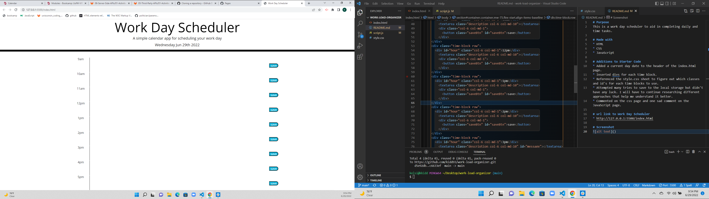

# Purpose
This is a work day scheduler to aid in completing daily and time tasks.

# Made with
* HTML
* CSS
* JavaScript

# Additions to Starter Code
* Added a current day date to the header of the index.html page.
* Inserted divs for each time block.
* Referenced the style.css sheet to figure out which classes and id's for each time blocks to use. 
* Added text does save to local storage.

# url link to Work Day Scheduler
* http://127.0.0.1:5500/index.html

# Screenshot 
